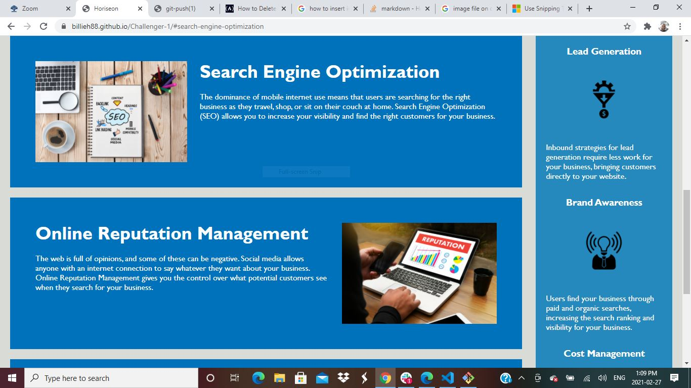
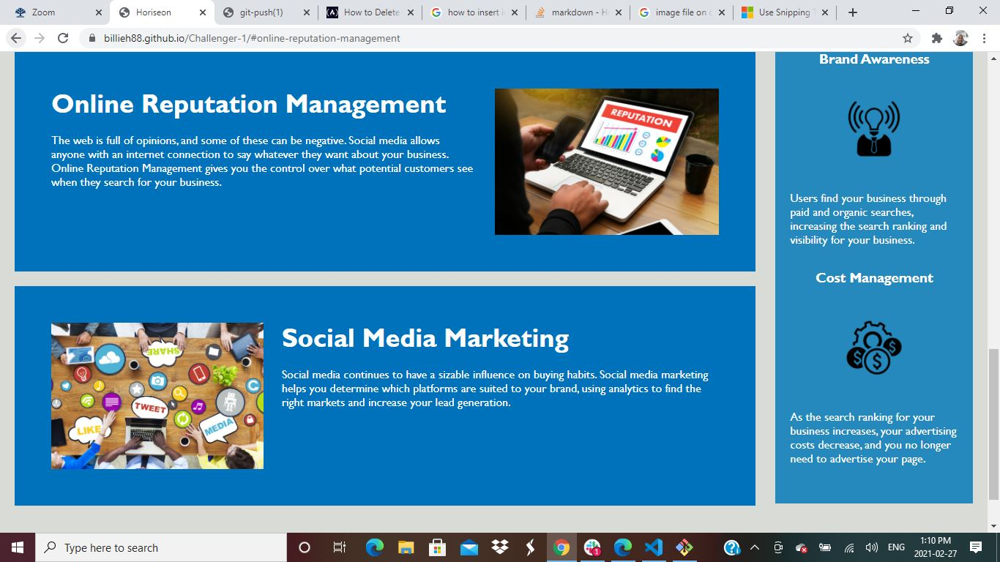
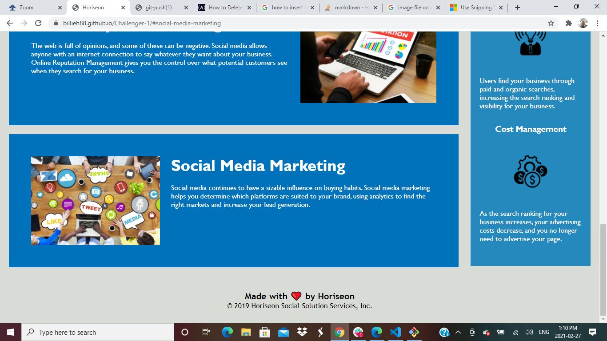

# 01 HTML CSS Git: Code Refactor
Assignment conducted by Billie Hussein

# Actions taken

1. Changed and set up website title in tab to reflect Horiseon
2. Fixed broken link by changing "div class="search-engine-optimization" to "Div ID="search-engine-optimization" class="search-engine-optimization">
3. Added an alt attribute to the 3 images describing what images consist of incase image does not appear.
4. Removed redundancy by Grouping the class elements with same definitions instead of writing down class element down seperately.
5. Corrected all the font-family with the proper format. i.e adding the punctuation marks on both sides of font style.
6.  Changed and used semantics for header, section, footer instead of div. Adjusted for in both html code and css code.

# Snapshots of the website 

Website with my URL

Website with first link clicked on

Website with second link clicked on

Website with third link clicked on